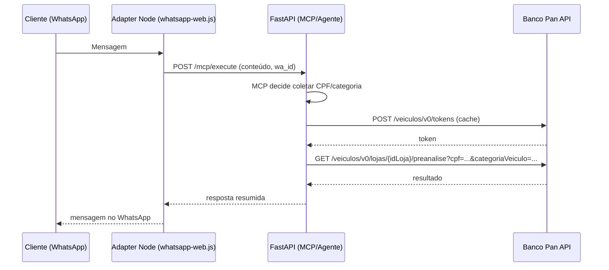

# Plano do POC – Loja de Veículos + WhatsApp Web + MCP + Banco Pan (Pré‑Análise)

## Objetivo
- Validar ponta‑a‑ponta: WhatsApp Web (adapter) → Backend FastAPI (MCP/agent) → Banco Pan (pré‑análise), usando GPT‑4o‑mini.
- Foco no fluxo mínimo: coletar CPF e categoria, chamar pré‑análise do Pan e retornar resumo simples.
- Sem lógicas complexas de diálogo neste momento; abordagem guiada e segura (LGPD) para POC.

## Escopo
- Responder inbound apenas; sem campanhas ou envios proativos.
- Sem catálogo de veículos, test‑drive ou avaliações (ficam para fase 2).
- Integração Banco Pan apenas nos endpoints de token e pré‑análise.

## Arquitetura (visão)

## Variáveis de ambiente necessárias
- PAN_BASE_URL (ex.: https://sandbox.exemplo)
- PAN_API_KEY
- PAN_BASIC_CREDENTIALS (string no formato APIKEY:SECRETKEY; será convertida em Base64 para Authorization: Basic)
- PAN_USERNAME
- PAN_PASSWORD
- PAN_LOJA_ID (id da loja padrão para o POC)
- REAL_ESTATE_ENABLED=false (evitar conflito com domínio de imóveis)

Obs.: manter `MCP_API_TOKEN` se desejar proteger o endpoint /mcp/execute.

## Regras de segurança e LGPD
- Exibir consentimento antes de enviar CPF para o Pan.
- Mascarar CPF em logs (ex.: ***123-45).
- Timeouts curtos e retries leves (backoff exponencial) na chamada ao Pan.
- Não persistir CPF além do necessário para a chamada.

## Fluxo de conversa (MVP)
1) Saudação rápida + aviso de POC e consentimento.
2) Perguntar CPF → validar formato.
3) Perguntar categoria do veículo (ex.: novo/usado); se não fornecido, usar default configurável.
4) Chamar `pan_pre_analise(cpf, categoria)` → formatar resposta amigável.
5) Encerrar com orientação simples e opção de falar com atendente.

## Tools MCP
- pan_gerar_token(): obtém token e cacheia com TTL; renova em 401/403.
- pan_pre_analise({cpf, categoria, id_loja?}): chama endpoint de pré‑análise usando `PAN_LOJA_ID` por padrão.
- (opcional) calcular_financiamento_local({preco, entrada_pct, prazo_meses, taxa_pct}) para complementar respostas sem chamar providers externos.

## Endpoints Pan (conforme docs-api)
- POST {PAN_BASE_URL}/veiculos/v0/tokens
  - Headers: Content-Type: application/json, ApiKey, Authorization: Basic <base64(APIKEY:SECRETKEY)>
  - Body: { username, password, grant_type: "client_credentials+password" }
- GET {PAN_BASE_URL}/veiculos/v0/lojas/{idLoja}/preanalise?cpf=<cpf>&categoriaVeiculo=<categoria>
  - Headers: Authorization: Bearer <Token>, ApiKey

Observação: os exemplos incluem Cookie, mas a integração server‑to‑server ideal não exige cookies; usar apenas headers padrão.

## Rate limit e resiliência
- Adapter WhatsApp: 1–2 msgs/seg máx. (local) para evitar bloqueios.
- Chamada ao Pan: limite interno de 1 req/s (POC); retries 2x com backoff.
- Cache de token em memória (TTL conforme expiração retornada; na ausência, TTL conservador: 25–30 minutos).

## Critérios de aceite do POC
- Coleta correta de CPF e categoria com consentimento.
- Chamada ao Pan concluída com resposta resumida ao usuário.
- Logs estruturados sem PII exposta (CPF mascarado).
- Fluxo repetível: QR code (sessão WhatsApp Web persistida).

## Plano de testes
- Sucesso: CPF válido + categoria válida → resposta do Pan formatada.
- Token expirado: forçar 401/403 → renovação automática e reexecução.
- Parâmetros inválidos: CPF malformado ou categoria ausente → mensagem de erro amigável.

## Roadmap após POC
- Catálogo de veículos (mock/CSV → API interna /autos/veiculos).
- Simulação de financiamento local mais completa.
- Agendamento de test‑drive.
- Handoff humano e painel simples de leads.
- Migração para WhatsApp Cloud API (adapter provider) mantendo a mesma interface.

## Observações operacionais
- O WhatsApp Web é não‑oficial; usar apenas para POC.
- O celular do WhatsApp deve permanecer online e com app aberto.

---

## Atualizações recentes (2025-09-20)

### O que foi implementado
- **Inventário de veículos (backend):**
  - `GET /veiculos` e `GET /veiculos/{id}` servindo os dados do inventário.
  - `POST /admin/veiculos/import-csv` para importação em massa (CSV de exemplo em `docs/import_veiculos_sample.csv`).
- **Importação de leads (backend):**
  - `POST /admin/leads/import-csv`.
- **UI (frontend):**
  - `VehiclesList.tsx`: lista com filtros (categoria, marca, preço) e cards com imagem, título, marca/modelo/ano e preço.
  - `VehicleDetalhes.tsx`: detalhes de veículo, exibe imagem e atributos principais.
  - `ImportCsv.tsx`: página unificada com duas seções (Leads e Veículos) e tratamento de erro **401 Não autenticado**.
  - Menu com item “Importar CSV”.
- **LLM local via Ollama (para testes internos enquanto aguardamos PAN):**
  - Variável no backend: `OLLAMA_BASE_URL` (default `http://localhost:11434`).
  - Rotas: `POST /llm/generate`, `POST /llm/chat` (proxy para Ollama, `stream=false` por padrão).
  - Rota de diagnóstico: `GET /llm/ping` (mostra tentativas e URL utilizada).
  - Fallbacks implementados no backend: tenta `OLLAMA_BASE_URL`, `http://host.docker.internal:11434` e `http://localhost:11434` em ordem, retornando detalhes de erro em caso de falha.

### Problemas encontrados e como evitar
- **Conectividade Docker ⇄ Host (Ollama):**
  - Problema: usar `http://localhost:11434` dentro do container aponta para o próprio container, falhando.
  - Solução: definir `OLLAMA_BASE_URL=http://host.docker.internal:11434` no `.env` e/ou usar os fallbacks implementados. Validar com `GET /llm/ping` (retorna `used_url`).
- **Falha 401 na importação via UI:**
  - Causa: sessão expirada ou não autenticado.
  - Solução: `ImportCsv.tsx` trata 401 com mensagem clara; recomendação de redirecionamento para `/login` se desejado.
- **Encoding no PowerShell (acentos/emoji):**
  - Sintoma: respostas exibiam “Olá!”.
  - Solução: `chcp 65001` e `OutputEncoding`/`Console.OutputEncoding` para UTF‑8; ou salvar a saída em arquivo UTF‑8.
- **Aspas no PowerShell ao enviar JSON:**
  - Sintoma: `PositionalParameterNotFound` quando havia aspas simples dentro de JSON.
  - Solução: usar `ConvertTo-Json`, here‑string `@"..."@` ou duplicar aspas simples.

### Plano futuro (aguardando credenciais do Banco Pan)
- **Operacional (PAN):**
  - Enviar e‑mail para `bancopanprd@service-now.com` com assunto `[OPENAPI-ACESSO] – ConcessaoDeAcesso` anexando: Termo de Aceite assinado, Formulário de Cadastro preenchido, aprovação do gerente comercial PAN.
  - Após liberação, preencher variáveis no `.env`:
    - `PAN_BASE_URL`, `PAN_API_KEY`, `PAN_BASIC_CREDENTIALS` (formato `APIKEY:SECRETKEY`), `PAN_USERNAME`, `PAN_PASSWORD`, `PAN_LOJA_ID`.
  - Habilitar integração real (desligar `PAN_MOCK` quando aplicável).
- **Backend (integração PAN):**
  - Implementar/ativar cliente com obtenção/renovação de token e `pre_analise` (respeitando headers e rate limit).
  - Endpoints internos: `POST /financiamento/pre-analise` e `POST /financiamento/simulacao` retornando payload normalizado.
  - Logs estruturados (sem PII), retries leves e masking de CPF em logs.
- **Chatbot/MCP:**
  - Construir diálogo base: consentimento LGPD, coleta de CPF, coleta de categoria (default configurável), chamada `pre_analise`, resposta amigável, fallback para atendente.
  - Com PAN em produção, alternar provider LLM conforme necessário (mantendo provider local para dev).
- **UI Financiamento:**
  - POC com formulário (CPF + categoria) chamando o endpoint interno (mock/real) e exibindo o resumo.

### Comandos úteis (diagnóstico rápido)
- API health: `GET /health/live`
- Diagnóstico LLM: `GET /llm/ping`
- Geração: `POST /llm/generate`
- Chat: `POST /llm/chat`

---

Este documento serve como guia referência do POC. Ajustes serão versionados neste arquivo conforme avançarmos.
